# 🚀 Simple Gemini AI Web App (Guía de Configuración Local)
## 🛠️ Creando una Interfaz Personalizada con la API de Google: Uso, Integración y Despliegue con HTML, CSS, JS : Local y en Vercel 😃🚀

Esta es una aplicación web básica que permite a los usuarios enviar consultas a la **API de Google Gemini** y ver las respuestas. Utiliza un frontend simple (HTML, CSS, JS) y un backend serverless (Node.js) que se ejecuta localmente simulando el entorno de Vercel con `vercel dev`.

## 📋 Prerrequisitos

Antes de comenzar, asegúrate de tener instalado lo siguiente:

1. **Node.js y npm:** Necesarios para ejecutar JavaScript en el backend, gestionar paquetes y usar Vercel CLI. Verifica tu instalación abriendo tu terminal y ejecutando:
   ```bash
   node -v
   npm -v
   ```
   Si no los tienes, descárgalos desde [nodejs.org](https://nodejs.org/) (se recomienda la versión LTS).

2. **Vercel CLI:** La herramienta de línea de comandos de Vercel. Instálala globalmente e inicia sesión:
   ```bash
   npm install -g vercel
   vercel login
   ```
   Sigue las instrucciones para autenticarte (generalmente a través del navegador).

3. **Google Gemini API Key:** Necesitas una clave API para usar Gemini. Puedes obtenerla desde [Google AI Studio](https://aistudio.google.com/) o la consola de Google Cloud. Asegúrate de que la API esté habilitada para tu proyecto.

4. **Un Editor de Código:** Como [Visual Studio Code](https://code.visualstudio.com/), Sublime Text, etc. En Nuestro Caso usaremos el VISUAL STUDIO CODE:


5. **Git (Opcional pero recomendado):** Si planeas usar GitHub.

## 🛠️ Herramientas Esenciales a Instalar

Instala estas herramientas iniciales y esenciales en tu computadora **ANTES** de empezar a crear los archivos del proyecto:

### 💻 PASO 1: Instalar Visual Studio Code (VS Code)

**¿Qué es?** Es el programa donde escribirás y editarás todo el código (HTML, CSS, JavaScript).

**¿Dónde conseguirlo?** Ve al sitio web oficial: https://code.visualstudio.com/

**Pasos de Instalación:**

1. Abre el enlace en tu navegador.
2. La página detectará automáticamente tu sistema operativo. Haz clic en el botón grande de descarga.
3. Se descargará un archivo instalador.
4. Ejecuta ese archivo.
5. En el asistente de instalación:
   - Acepta el acuerdo de licencia.
   - Elige la carpeta de instalación (la ubicación por defecto suele estar bien).
   - En "Tareas Adicionales", asegúrate de marcar "Agregar al PATH" (**importante**).
   - Haz clic en "Instalar".
6. ¡Listo! Ahora puedes buscar "Visual Studio Code" en tu menú de inicio y abrirlo.


## VISUAL STUDIO DESCARGAR E INSTALAR- VAMOS AL ENLACE:

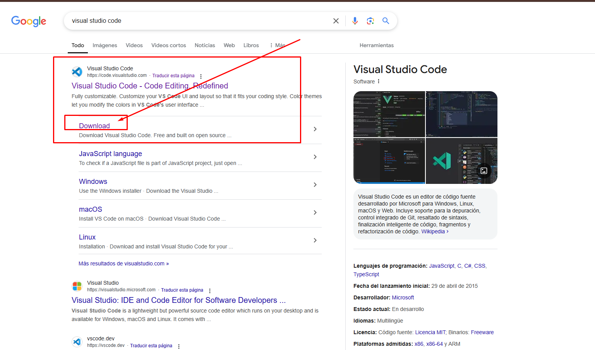

## LE DAMOS A ESTA OPCION DE WINDOWS O EL SISTEMA QUE TENGAMOS:


## PANTALLA PRINCIPAL UNA VEZ HEMOS INSTALADO:

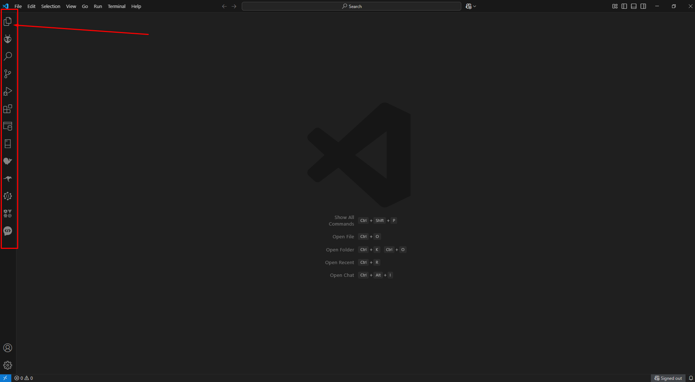


### ⚙️ PASO 2: Instalar Node.js y npm

**¿Qué es?** Node.js es el entorno que permite ejecutar JavaScript fuera del navegador. npm (Node Package Manager) viene incluido y se usa para instalar librerías.

**¿Dónde conseguirlo?** Ve al sitio web oficial: https://nodejs.org/

**Pasos de Instalación:**

1. Abre el enlace en tu navegador.
2. Elige la versión **LTS** (Long Term Support).
3. Ejecuta el archivo descargado.
4. En el asistente de instalación:
   - Acepta los términos de licencia.
   - Elige la carpeta de instalación.
   - Asegúrate de que la opción "Add to PATH" esté seleccionada (**crucial**).
   - Haz clic en "Instalar".
5. **Verificación Importante:**
   - Cierra TODOS los terminales abiertos.
   - Abre un NUEVO terminal.
   - Escribe `node -v` y presiona Enter.
   - Escribe `npm -v` y presiona Enter.
   - Si ves números de versión, ¡todo está correcto!
 
## NODE DESCARGAR E INSTALAR- VAMOS AL ENLACE:

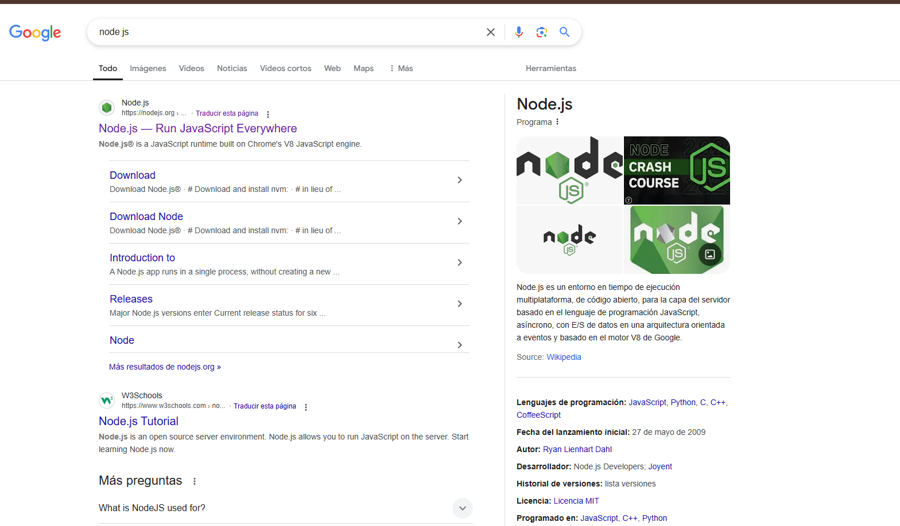

## LE DAMOS A ESTA OPCION:

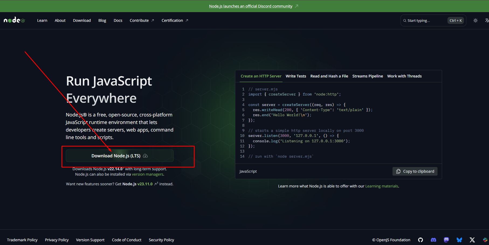
 
   

### 🔄 PASO 3: Instalar Vercel CLI

**¿Qué es?** Es la herramienta de línea de comandos de Vercel para ejecutar y desplegar tu proyecto.

**Pasos de Instalación:**

1. Abre un terminal.
2. Escribe el siguiente comando y presiona Enter:
   ```bash
   npm install -g vercel
   ```
3. Verifica la instalación:
   ```bash
   vercel --version
   ```
4. Iniciar Sesión:
   ```bash
   vercel login
   ```
5. Sigue las instrucciones para autorizar la conexión.

## 📁 Pasos de Configuración

Sigue estos pasos para configurar y ejecutar el proyecto en tu máquina local.

### 1. Crear la Carpeta del Proyecto

Crea una carpeta en tu computadora donde vivirá el proyecto. Abre tu terminal y usa:

```bash
# Elige una ubicación (ej. Escritorio)
cd ~/Desktop
# Crea la carpeta del proyecto
mkdir mi-proyecto-ia
# Entra en la carpeta
cd mi-proyecto-ia
```

### 2. Estructura de Archivos

Tu proyecto tendrá esta estructura:

```
mi-proyecto-ia/
├── api/
│   └── generate.js      <-- Archivo de la función serverless
├── .env                 <-- Archivo para la API Key (local)
├── .gitignore           <-- Archivo para ignorar archivos en Git/Vercel
├── index.html           <-- El frontend de la aplicación
├── style.css            <-- Estilos CSS para el frontend
└── package.json         <-- Se creará con npm init
```

Para crear esta estructura, dentro de la carpeta del proyecto ejecuta:

```bash
# Dentro de mi-proyecto-ia
mkdir api
touch index.html style.css .env .gitignore api/generate.js
```


Este archivo define la **estructura y el contenido** de la página web que el usuario ve e interactúa.

*   **Definición Estructural:** Establece la estructura básica del documento HTML (`<!DOCTYPE html>`, `<html>`, `<head>`, `<body>`).
*   **Metadatos y Enlaces:** Configura metadatos (`<meta>`), el título de la página (`<title>`), el ícono (`<link rel="shortcut icon">`), y enlaza hojas de estilo externas (`<link rel="stylesheet" href="style.css">`) y librerías CSS (Prism).
*   **Contenedor Principal:** Envuelve todo el contenido visible en un `<div class="container">` para facilitar el diseño y la organización.
*   **Interfaz de Usuario (UI):**
    *   **Botón de Tema:** Incluye un botón (`<button id="themeToggle">`) para cambiar entre modo claro y oscuro.
    *   **Título y Avatar:** Muestra el título principal (`<h1>`) y una imagen de avatar (``).
    *   **Área de Prompt:** Proporciona un campo de texto (`<textarea id="promptInput">`) para que el usuario ingrese su consulta.
    *   **Botones de Acción Principal:** Agrega botones para "Enviar" (`<button id="executeBtn">`) la consulta y "Limpiar" (`<button id="clearBtn">`) la interfaz, incluyendo iconos SVG.
    *   **Área de Resultados:** Define un encabezado (`<h3>`) y un contenedor (`<div id="resultBox">`) donde se mostrará la respuesta de la IA.
    *   **Botones de Acción de Resultado:** Incluye botones para "Copiar" (`<button id="copyBtn">`) y "Guardar" (`<button id="saveBtn">`) la respuesta, con iconos SVG.
*   **Indicador de Carga:** Añade un elemento visual (`<div id="loading">`) que se muestra mientras se espera la respuesta de la IA.
*   **Inclusión de Scripts:** Carga librerías JavaScript externas necesarias (`marked.min.js`, `prism-core.min.js`, `prism-autoloader.min.js`) al final del `<body>`.
*   **Script Principal:** Contiene el código JavaScript embebido (`<script>...</script>`) que maneja la lógica del frontend de la aplicación.


# 📄 Código del Archivo `index.html`

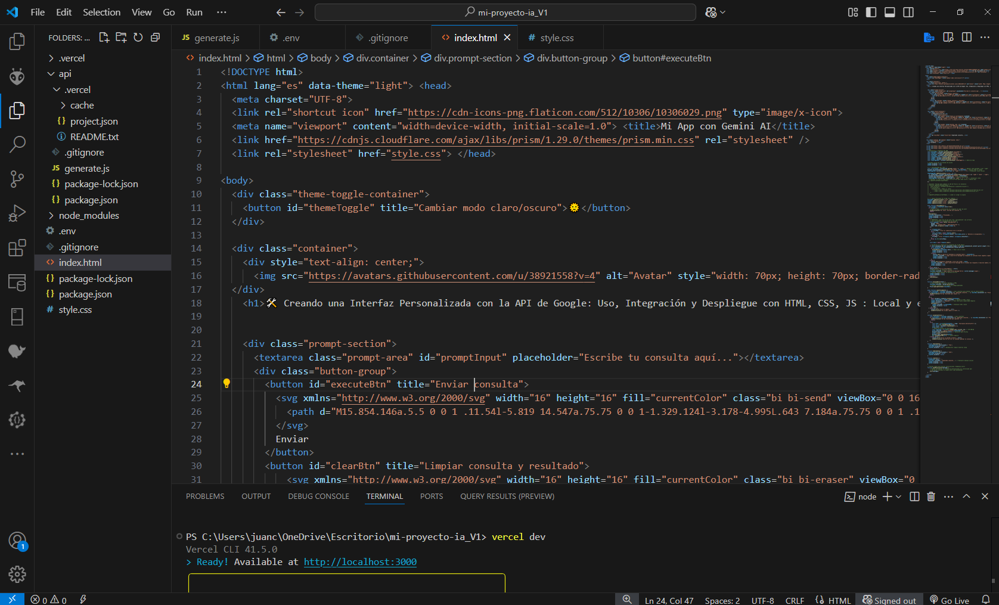


## 📋 Estructura del Documento

Este archivo HTML crea una interfaz de usuario simple para interactuar con la API de Google Gemini. Incluye:

### 🧩 Componentes Principales

1. **Contenedor Principal**
   - Título de la aplicación
   - Sección para ingresar prompts
   - Sección para mostrar resultados

2. **Sección de Prompt**
   - Campo de texto para escribir consultas
   - Botón "Enviar" con icono SVG
   - Botón "Limpiar" con icono SVG

3. **Sección de Resultados**
   - Encabezado que indica "Respuesta de la IA"
   - Botón "Copiar" para copiar resultados al portapapeles
   - Botón "Guardar" para descargar resultados como archivo de texto
   - Área donde se muestra la respuesta

4. **Indicador de Carga**
   - Animación spinner
   - Texto "Cargando..."

### 📚 Librerías Externas

- **Marked.js**: Para conversión de markdown a HTML
- **Prism.js**: Para resaltado de sintaxis en bloques de código

## 📜 Funcionalidad ✨ (JavaScript)

Este script maneja la **interactividad del usuario y la comunicación con el backend** directamente en el navegador.

*   **Referencias DOM:** Obtiene referencias a los elementos HTML clave (botones, textarea, caja de resultados, indicador de carga) usando `document.getElementById`.
*   **Manejo de Eventos:** Asigna funciones a los eventos `click` de los botones (Enviar, Limpiar, Copiar, Guardar, Tema) usando `addEventListener`.
*   **Lógica de Tema:**
    *   Detecta y aplica el tema guardado (`localStorage`) al cargar la página.
    *   Alterna el atributo `data-theme` en `<html>` al hacer clic en el botón de tema.
    *   Guarda la preferencia del tema en `localStorage`.
    *   Actualiza el icono/texto del botón de tema.
*   **Función `executeQuery()`:**
    *   Obtiene el `prompt` del usuario desde el textarea.
    *   Muestra el indicador de carga y deshabilita botones.
    *   Realiza una petición `fetch` de tipo `POST` al endpoint del backend (`/api/generate`), enviando el `prompt` en formato JSON.
    *   Maneja la respuesta: si es exitosa, llama a `displayResult()`; si hay error, muestra un mensaje de error en la caja de resultados.
    *   Oculta el indicador de carga y rehabilita botones al finalizar (`finally`).
*   **Función `displayResult()`:**
    *   Utiliza la librería `marked.parse()` para convertir la respuesta (que puede venir en formato Markdown) a HTML.
    *   Inserta el HTML resultante en la caja de resultados (`resultBox.innerHTML`).
    *   Utiliza `Prism.highlightAllUnder()` para aplicar resaltado de sintaxis a los bloques de código dentro de la respuesta.
    *   Habilita los botones de Copiar y Guardar.
*   **Función `copyToClipboard()`:**
    *   Obtiene el texto plano (`innerText`) de la caja de resultados.
    *   Utiliza la API del Portapapeles (`navigator.clipboard.writeText()`) para copiar el texto.
    *   Muestra una confirmación visual temporal en el botón "Copiar".
    *   Maneja errores si la copia falla.
*   **Función `saveAsTextFile()`:**
    *   Obtiene el texto plano (`innerText`) de la caja de resultados.
    *   Crea un `Blob` (objeto binario) con el texto.
    *   Genera una URL temporal para el Blob (`URL.createObjectURL`).
    *   Crea un enlace (`<a>`) invisible, le asigna la URL y un nombre de archivo (`.txt`).
    *   Simula un clic en el enlace para iniciar la descarga.
    *   Limpia la URL temporal (`URL.revokeObjectURL`).
*   **Funciones de Utilidad:**
    *   `showLoading()` / `hideLoading()`: Controlan la visibilidad del indicador de carga y el estado `disabled` de los botones.
    *   `clearAll()`: Limpia el área de prompt y la caja de resultados, restableciendo los botones a su estado inicial.
    *   `showNotification()`: Muestra mensajes simples al usuario (actualmente usa `alert`, podría mejorarse).
      
- [✅] Captura todos los elementos clave de la página HTML (botones 🔘, área de texto 📝, caja de resultados 📄) para darles funcionalidad.
- [✅] Implementa un cambio de tema 🎨 con opción entre modo claro ☀️ y oscuro 🌙, recordando la preferencia 💾 para futuras visitas.
- [✅] Gestiona el envío de consultas 🚀 con animación de carga ⏳ y comunicación segura con el backend 📡, que se conecta con la IA de Google Gemini 🤖.
- [✅] Maneja cuidadosamente tanto respuestas exitosas ✅ como posibles errores ❌.
- [✅] Formatea la respuesta de la IA con Markdown (**negritas**, listas) y colorea bloques de código 🌈 para mejorar la legibilidad.
- [✅] Proporciona botones para copiar 📋 el texto de la respuesta o descargarlo como archivo `.txt` 📁.
- [✅] Incluye funciones adicionales para controlar la animación de carga ⏳, limpiar la interfaz 🧹 y mostrar notificaciones 🔔 al usuario.
  
 ### 🔄 Principales funciones JavaScript:

- **executeQuery()**: Envía consultas a la API y procesa respuestas
- **displayResult()**: Muestra resultados formateados
- **copyToClipboard()**: Copia resultados al portapapeles
- **saveAsTextFile()**: Guarda resultados como archivo .txt
- **showLoading() / hideLoading()**: Controla la visibilidad del indicador de carga
- **clearAll()**: Limpia la consulta y los resultados
 
# CSS Styles Documentation: CSS (`style.css`)

Este archivo define la **apariencia visual y el diseño (layout)** de la aplicación web, asegurando que sea atractiva y funcional en diferentes dispositivos.

*   **Variables CSS (Custom Properties):** Define una paleta de colores, tamaños de fuente, espaciados y otros valores reutilizables (`:root`). Crucial para implementar los temas claro y oscuro (`[data-theme="dark"]`).
*   **Reset y Estilos Globales:** Aplica estilos base (`html`, `body`, `*`) para normalizar la apariencia entre navegadores y establece la fuente, tamaño de texto y altura de línea predeterminados.
*   **Estilo del Contenedor:** Da estilo al `<div class="container">` principal (ancho máximo, márgenes, padding, fondo, sombra, bordes redondeados).
*   **Estilo de Secciones:** Define la apariencia del área de prompt (`.prompt-section`, `.prompt-area`) y del área de resultados (`.result-container`, `.result-header`, `.result-box`).
*   **Estilo de Botones:** Aplica estilos generales a todos los botones (`button`) y estilos específicos a los botones de acción (Enviar, Limpiar, Copiar, Guardar, Tema) con colores distintivos, iconos SVG y efectos para estados (hover, active, disabled).
*   **Formato de Resultados:** Estiliza el texto dentro de la caja de resultados (`.result-box`), incluyendo texto normal, negritas (`<strong>`), enlaces (`<a>`), código inline (`<code>`), y bloques de código (`pre[class*="language-"]`) formateados con Prism.js. Ajusta el espaciado (`margin`, `line-height`) para mejorar la legibilidad.
*   **Indicador de Carga:** Da estilo al spinner animado (`.loading`, `.spinner`) y al texto asociado, asegurando que se muestre centrado y sobre el contenido.
*   **Botón de Tema:** Posiciona y estiliza el botón de cambio de tema (`.theme-toggle-container`, `#themeToggle`).
*   **Diseño Responsivo (Media Queries):** Utiliza `@media` para ajustar el layout, tamaños de fuente y espaciados en pantallas más pequeñas (tablets, móviles), asegurando una buena experiencia de usuario en cualquier dispositivo.

## 1. Variables CSS (Custom Properties)
## 2. Reset y Box-Sizing Global
## 3. Estilos del Contenedor Principal
## 4. Sección del Prompt
## 5. Grupos de Botones
## 6. Sección de Resultados
## 7. Loading Spinner
## 8. Media Queries para Responsividad


# Codigo Arvhivo CSS Hoja Styles.css

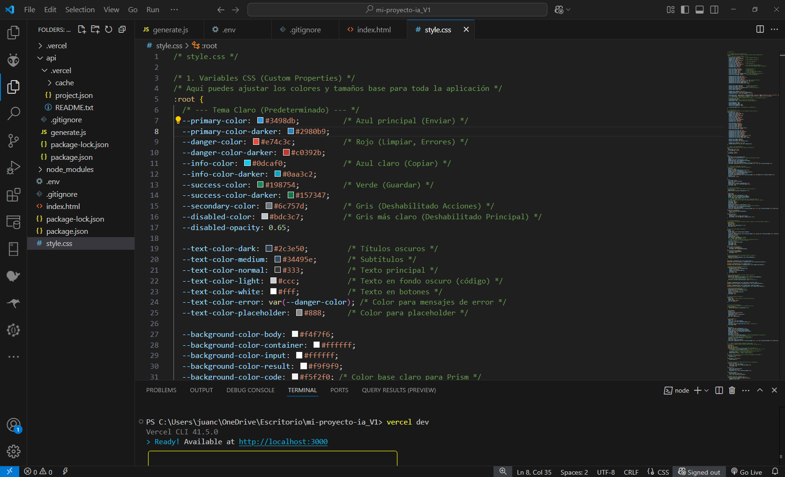

# Codigo Arvhivo CSS Hoja Styles.css


## 🎨 Funcionalidades de la App ✨ (Codigo Estilo Style.CSS):

- [✅] Define el estilo visual de la aplicación Gemini AI, asegurando una apariencia coherente y atractiva 💅.
- [✅] Establece una **paleta de colores** 🎨 con **variables CSS**, permitiendo cambiar entre modo claro ☀️ y oscuro 🌙 con facilidad.
- [✅] Realiza un **"reset"** 🧹 para una apariencia uniforme en todos los navegadores, ajustando la **fuente principal** 🔡, el fondo y el color del texto con transiciones suaves ✨.
- [✅] Da forma al **contenedor principal** 🖼️ con bordes redondeados y sombras sutiles, mejorando la estética y legibilidad.
- [✅] Estiliza el **área de texto** 📝 para que sea clara y funcional, junto con **botones** 🔘 diferenciados por colores y efectos visuales.
- [✅] Diseña la **caja de resultados** 📜 con una fuente monoespaciada 💻 y ajustes específicos para mejorar la legibilidad de texto y código resaltado 🌈.
- [✅] Define el estilo del **indicador de carga** ⏳ (ruedita giratoria ⚙️), asegurando una apariencia elegante y centrada.
- [✅] Proporciona un diseño para el botón de cambio de tema ☀️/🌙, facilitando la alternancia entre modos visuales.
- [✅] Usa **Media Queries** 📱💻 para garantizar que la aplicación sea **responsiva**, adaptándose perfectamente a distintas pantallas y dispositivos 👍.

# Project Documentation

## JavaScript (Backend - `api/generate.js`)

Este archivo se ejecuta en el **servidor** (o entorno serverless como Vercel) y actúa como intermediario seguro entre el frontend y la API de Google Gemini.

*   **Carga de Entorno:** Utiliza `require('dotenv').config()` para cargar variables de entorno (como la API Key) desde un archivo `.env` (principalmente para desarrollo local).
*   **Dependencias:** Importa `axios` para realizar llamadas HTTP a la API externa de Google.
*   **Manejo de CORS:** Define e implementa un middleware (`allowCors`) que añade las cabeceras HTTP necesarias (`Access-Control-Allow-Origin`, etc.) para permitir que el frontend (que se ejecuta en un origen diferente, como `localhost:3000`) pueda realizar peticiones a este endpoint de API sin ser bloqueado por las políticas de seguridad del navegador (CORS). También maneja las peticiones `OPTIONS` (preflight).
*   **Función Handler (`handler`):** Es la función principal que Vercel ejecutará cuando se reciba una petición en la ruta `/api/generate`.
    *   **Validación de Método:** Verifica que la petición sea de tipo `POST`.
    *   **Extracción de Datos:** Obtiene el `prompt` enviado desde el frontend en el cuerpo (`req.body`) de la petición. Valida que el prompt exista.
    *   **Acceso a API Key:** Obtiene de forma segura la `GOOGLE_API_KEY` desde las variables de entorno (`process.env`). Valida que la clave exista y devuelve un error genérico si falta, sin exponer detalles.
    *   **Llamada a la API Externa:** Construye la URL del endpoint de la API de Google Gemini. Utiliza `axios.post` para enviar el `prompt` (en el formato esperado por Google) a la API de Gemini, incluyendo la `apiKey`.
    *   **Manejo de Respuesta:** Si la llamada a Google es exitosa, envía la respuesta (`response.data`) de vuelta al frontend con un estado `200 OK`.
    *   **Manejo de Errores:** Si ocurre un error al llamar a la API de Google (ej. red, clave inválida, error de Google), captura el error (`catch`), registra detalles en la consola del servidor (`console.error`), y envía una respuesta de error JSON al frontend con un código de estado apropiado (ej. `500`, `400`) y un mensaje de error más genérico y seguro.
*   **Exportación:** Exporta la función `handler` envuelta en el middleware `allowCors` para que Vercel pueda utilizarla (`module.exports = allowCors(handler)`).
  
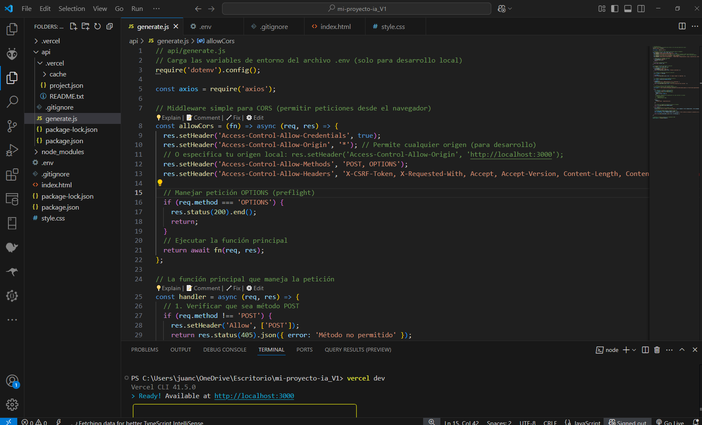

## API Implementation (api/generate.js)


## 🧠 Funcionalidades del Backend: ✨ (api/generate.js):

Este archivo JavaScript (`api/generate.js`) es el **intermediario inteligente** 🤖 entre tu bonita interfaz web y la poderosa API de Google Gemini. Se ejecuta en el servidor (o en un entorno serverless como Vercel ✨) y realiza el trabajo pesado.

🔑 Al principio, usa `require('dotenv').config()` para cargar **variables secretas** (como tu clave API de Google) desde un archivo `.env` cuando trabajas localmente. ¡Un comentario clave nos recuerda lo importante que es esto para no exponer nuestras claves! 🤫 También importa `axios` axios , una herramienta popular para hacer llamadas a otras APIs por internet 🌐.

🛡️ Luego define `allowCors`, una función **guardiana de seguridad** muy importante. Los navegadores 🌐 tienen reglas estrictas (CORS) que impiden que tu página web llame directamente a APIs en otros dominios. `allowCors` añade las cabeceras HTTP necesarias (como `Access-Control-Allow-Origin`) para que tu frontend pueda hablar con este backend sin problemas de permisos 🚦. ¡Es como darle un pase VIP a tu interfaz!

⚙️ La función principal se llama `handler`. Actúa como un **controlador de tráfico** 🚦:

1.  Verifica que la petición del navegador sea del tipo correcto (`POST`). Si no, ¡la rechaza! 🚫
2.  Extrae la consulta (`prompt`) que el usuario escribió y se aseguró de que no esté vacía ✅.
3.  Busca de forma segura la `GOOGLE_API_KEY` en las variables de entorno. Si no la encuentra, ¡lanza un error interno sin revelar la clave! 👍
4.  Construye la URL exacta 🎯 para hablar con el modelo `gemini-1.5-flash-latest` de Google, añadiendo la clave API.

🚀 Dentro de un bloque `try...catch` (para manejar errores elegantemente 🛡️), usa `axios.post` para **enviar la consulta del usuario** (formateada como Google espera) a la API de Gemini.
*   ✅ Si Google responde con éxito, el `handler` simplemente toma la respuesta de la IA (`response.data`) y la **envía de vuelta al navegador** del usuario.
*   💥 Si algo sale mal (error de red, clave inválida, etc.), el `catch` se activa. Registra un error detallado para el desarrollador (`console.error` 🕵️‍♂️) pero envía un **mensaje de error más simple y seguro** al navegador del usuario 📨.

📦 Finalmente, `module.exports = allowCors(handler)` **empaqueta** la función `handler` con el guardián `allowCors` y la exporta, lista para ser usada por la plataforma serverless (Vercel) Vercel .


## 📦 .gitignore Configuration: Aqui en este archivo vas a Poner los Arvhivos que no 🚫 deben subirse al Github o Vercel.

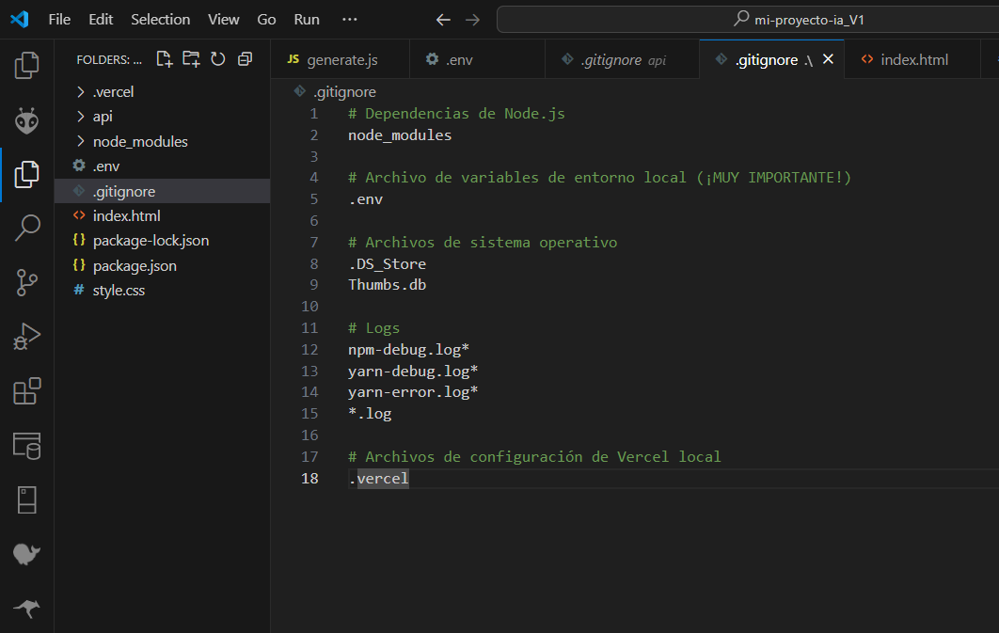

Este archivo `.gitignore` es esencial para mantener tu repositorio limpio y libre de archivos innecesarios 🚀. En él se excluyen las **dependencias de Node.js** (`node_modules`) 📦, asegurando que el código fuente no se sobrecargue con paquetes instalados. También protege el **archivo de variables de entorno** (`.env`) 🔑, que suele contener información sensible como claves API o configuraciones privadas. Se omiten **archivos de sistema** como `.DS_Store` (macOS) y `Thumbs.db` (Windows) 🖥️, junto con **logs de depuración** (`npm-debug.log*`, `yarn-debug.log*`, `yarn-error.log*`, `*.log`) 🔍 para evitar archivos innecesarios en el historial de Git. Finalmente, se excluyen las **configuraciones locales de Vercel** (`.vercel`) 🌐, garantizando que cada desarrollador tenga su propia configuración sin afectar el repositorio principal. ¡Una herramienta clave para proyectos ordenados y eficientes! ✅
```
# Dependencias de Node.js
node_modules

# Archivo de variables de entorno local (¡MUY IMPORTANTE!)
.env

# Archivos de sistema operativo
.DS_Store
Thumbs.db

# Logs
npm-debug.log*
yarn-debug.log*
yarn-error.log*
*.log

# Archivos de configuración de Vercel local
.vercel
```

## Environment Variables (.env): Copia esta Linea de Codigo en el archivo .env: Aqui va la Clave APiKey que te Dio Google AI Studio. (No Puede ser Publica)

Las **variables de entorno** `.env` son esenciales para mantener seguras y organizadas las configuraciones privadas de una aplicación 🔒. En este archivo, se debe incluir la clave API de Google AI Studio (`GOOGLE_API_KEY`) sin comillas ni espacios adicionales, asegurando que solo el entorno local pueda acceder a ella. Es **fundamental** no compartir ni exponer esta clave públicamente 🚫, ya que podría comprometer la seguridad de la aplicación. Gracias a este archivo, las credenciales y configuraciones sensibles quedan protegidas, evitando que sean subidas accidentalmente al repositorio y garantizando una gestión segura del acceso a servicios externos 🛡️.

```
# Pega tu clave API de Google aquí SIN comillas ni espacios extra
GOOGLE_API_KEY=AIzaSyXXXXXXXXXXXXXXXXXXXXXXXXXXXXXXXXXXX
```

## Project Setup Instructions

### Inicializar npm e Instalar Dependencias: SIgue estos Pasos: En Visual Studio:

Para configurar el proyecto correctamente 🛠️ en **Visual Studio**, primero debes abrir la terminal dentro de la carpeta `mi-proyecto-ia` 📂. Luego, inicia **npm** con `npm init -y` 📝, lo que generará el archivo `package.json` automáticamente con las configuraciones por defecto. Después, instala las dependencias necesarias con `npm install axios cors dotenv` 📦. `axios` 🔗 te permitirá hacer solicitudes HTTP, `cors` 🌐 gestionará las reglas de acceso entre servidores, y `dotenv` 🔑 será esencial para manejar las variables de entorno de manera segura. Siguiendo estos pasos, tu entorno estará listo para comenzar el desarrollo 🚀.

#### Abre tu terminal en Visual Studio dentro de la carpeta mi-proyecto-ia y ejecuta los siguientes comandos:

```bash

# 1. Inicializa npm (crea package.json)
# La opción -y acepta todas las configuraciones por defecto

npm init -y

# 2. Instala las dependencias necesarias (axios, cors, dotenv)

npm install axios cors dotenv


```

### Ejecutar el Proyecto Localmente: EN la misma Terminal:

##### Ahora estás listo para probar la aplicación en tu computadora.

1. **Iniciar el Servidor de Desarrollo Vercel**

Para ejecutar el proyecto localmente 🏃‍♂️, primero asegúrate de estar en la carpeta `mi-proyecto-ia` 📂 dentro de tu terminal en **Visual Studio**. Luego, inicia el **Servidor de Desarrollo de Vercel** con el comando `vercel dev` 🚀. Esto levantará el entorno local para probar tu aplicación antes de desplegarla en producción. Con esta configuración, podrás ver los cambios en tiempo real, realizar pruebas y asegurarte de que todo funcione correctamente antes de compartir tu proyecto 🌍. ¡Listo para desarrollar! 🔥

   En tu terminal (aún dentro de la carpeta mi-proyecto-ia), ejecuta: Vercel dev

   ```bash
   
   vercel dev
   
   ```

2. **Responder a las Preguntas de Configuración (Solo la Primera Vez)**

   ##### Si es la primera vez que ejecutas vercel dev en esta carpeta, Vercel CLI necesita asociarla con tu cuenta y un proyecto (incluso para desarrollo local). Te hará algunas preguntas:

   - `? Set up and deploy "[ruta/a/tu/carpeta]"?` -> Responde con la Letra (Y) (o presiona Enter).
   - `? Which scope should contain your project?` -> Selecciona tu scope personal (tu nombre de usuario) o Simplemente presiona Enter.
   - `? Link to existing project?` -> Responde con la Letra (N) (o presiona Enter), ya que es nuevo para Vercel.
   - `? What's your project's name?` -> Presiona Enter: Si quieres Cambiar el Nombre del Proyecto Escribe un nombre válido, todo en minúsculas (ej. mi-proyecto-ia) y presiona Enter.
   - `? In which directory is your code located?` -> Presiona Enter.
   - (Si aparece) `? Want to modify these settings?` -> Responde N (o presiona Enter).

   Después de responder, Vercel guardará esta configuración en una carpeta oculta .vercel y no volverá a preguntar en futuras ejecuciones de vercel dev en esta carpeta.

3. **Acceder a la Aplicación**

   Una vez que vercel dev termine de iniciarse, verás un mensaje como:

   ```
   > Ready! Available at http://localhost:3000
   ```

   (El puerto podría ser 3001 o similar si el 3000 está ocupado).

   Abre tu navegador web y ve a la dirección indicada (ej. http://localhost:3000).

4. **Probar la Aplicación**

   - Deberías ver la interfaz web "Interactúa con Gemini".
   - Escribe una consulta en el área de texto.
   - Haz clic en "Enviar".
   - Verás el indicador "Cargando..." y, si todo es correcto, la respuesta de Gemini aparecerá en la caja de resultados.

## Captura:

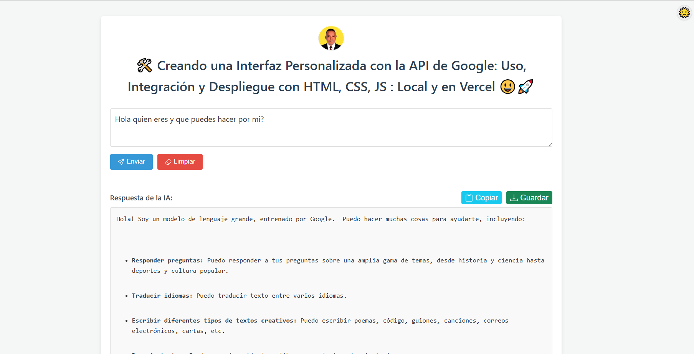


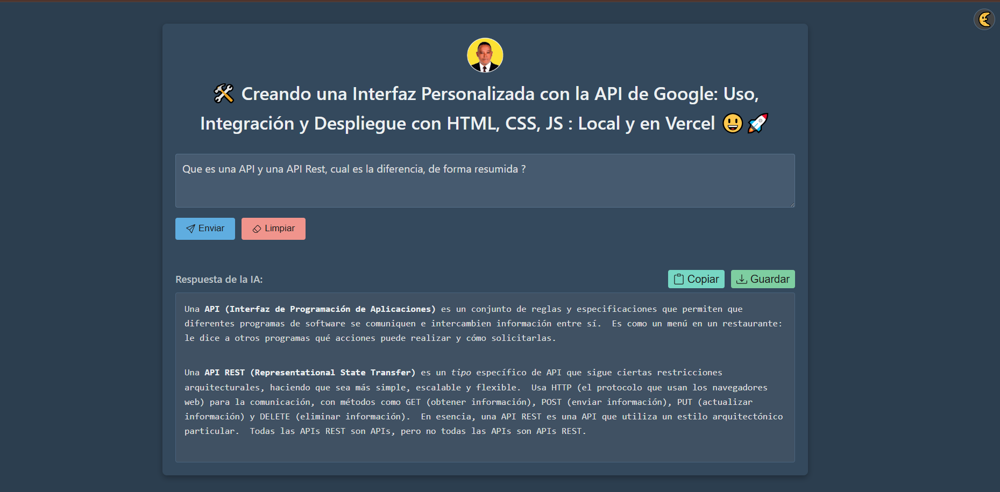

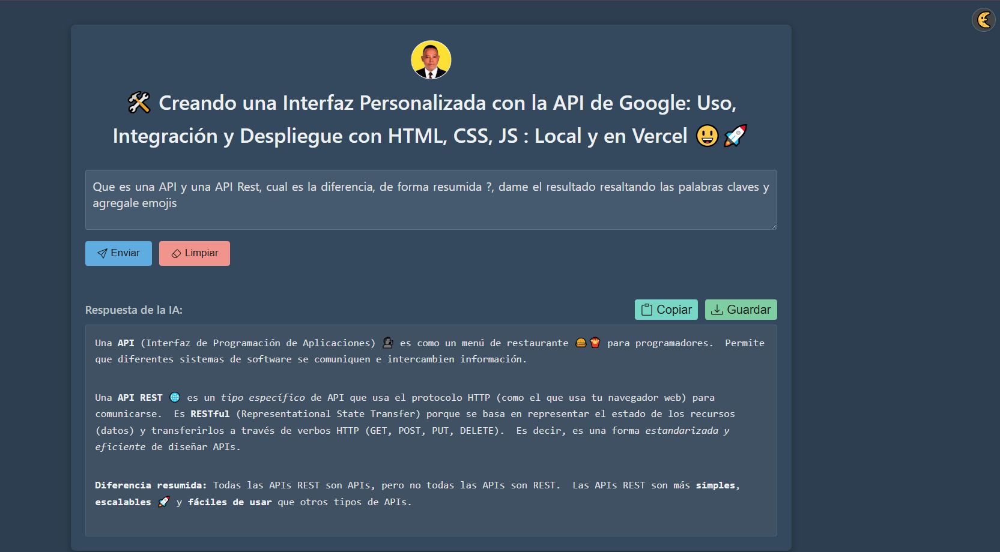

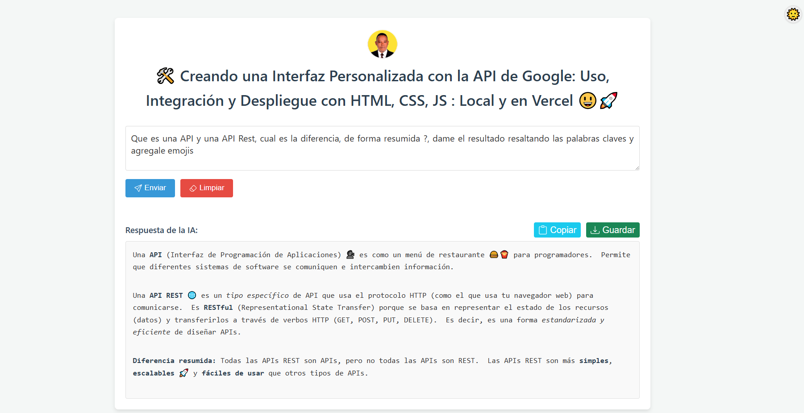

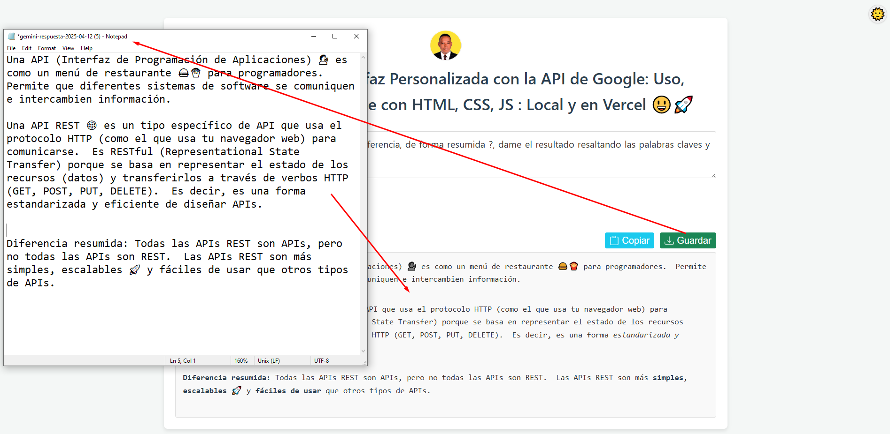

5. **Detener el Servidor Local**

   Cuando termines de probar, vuelve al terminal donde se ejecuta vercel dev y presiona Ctrl + C. Confirma si te lo pide (S o Y).

## Despliegue en Vercel (Opcional)

Si quieres desplegar tu aplicación en la web 🌍, Vercel te ofrece una opción rápida y eficiente. Para hacerlo, solo necesitas ejecutar el comando `vercel deploy --prod` 🚀 en tu terminal, lo que iniciará el proceso de despliegue en producción. Luego, es **fundamental** configurar la clave API 🔑 en Vercel para garantizar que el proyecto funcione correctamente. Para ello, ve al **dashboard** de tu proyecto en Vercel, accede a `Settings -> Environment Variables` ⚙️ y agrega tu clave API. Con estos pasos, tu aplicación estará lista para ser accesible desde cualquier lugar. ¡Tu proyecto ahora vive en la nube! ☁️✨
Si deseas desplegar tu aplicación en la web:

1. Ejecuta el comando de despliegue:
   ```bash
   vercel deploy --prod
   ```

2. Configura la API Key en Vercel:
   - Ve al dashboard de tu proyecto en Vercel -> Settings -> Environment Variables

## Captura:

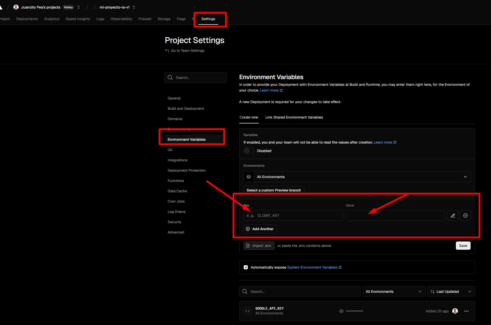
     
   - Añade una variable llamada GOOGLE_API_KEY con tu clave API como valor
   - Asegúrate de que esté disponible para Production, Preview y Development

3. Despliega: Desde tu terminal en la carpeta del proyecto, ejecuta el comando de despliegue nuevamente si es necesario.

Puedes volver a ejecutar el comando de despliegue 📤 desde tu terminal dentro de la carpeta del proyecto con `vercel deploy --prod` 🚀. Esto asegurará que los cambios recientes sean reflejados en tu aplicación en la web 🌍. Una vez que el despliegue se complete, prueba la aplicación en tu **PC o móvil** 📱💻 para verificar que todo funcione correctamente. ¡Ahora tu proyecto está en acción y listo para ser usado por cualquier persona desde cualquier dispositivo! 🎉✨

  ## Ahora Solo debe probar en tu pc o movil. 

### Los invito a entrar al **repo**, donde encontrarán la guía completa para implementar la API de Google en una interfaz personalizada. Síganla paso a paso y exploren todas sus posibilidades.

💬 No duden en dejar cualquier comentario en redes sociales, ¡me encanta conocer sus opiniones y mejoras!  
📢 Si les gustó el contenido, síganme para más guías y tutoriales sobre desarrollo y tecnología.  
🌍 Compártanlo con su comunidad para que llegue a más personas apasionadas por la innovación.  
⭐ Y no olviden dejarle una **estrellita en GitHub**, eso ayuda muchísimo a seguir creando contenido útil para todos.  

### Nos vemos en el próximo proyecto. ¡A programar se ha dicho! 😃🔥  

---

